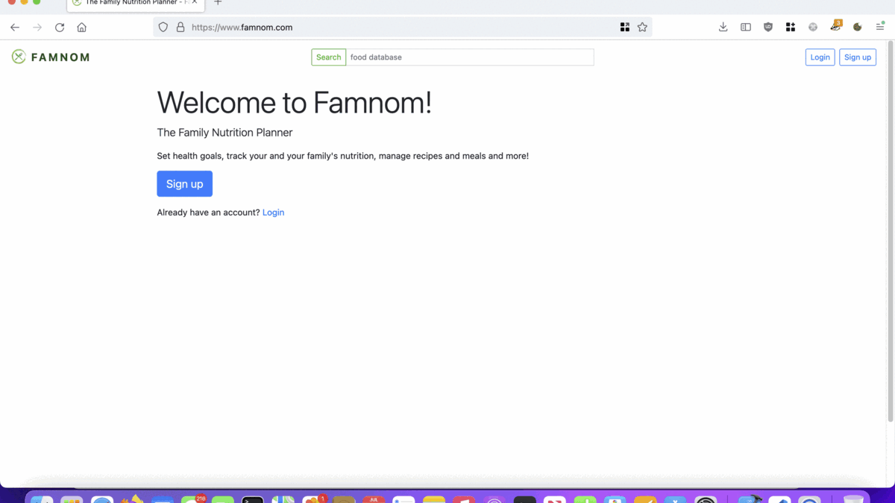
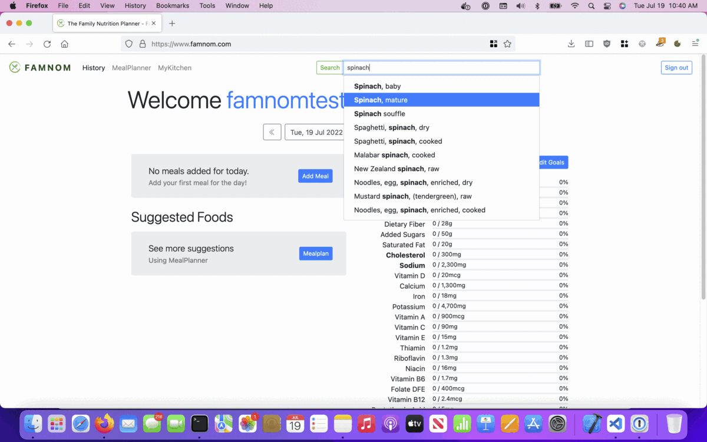
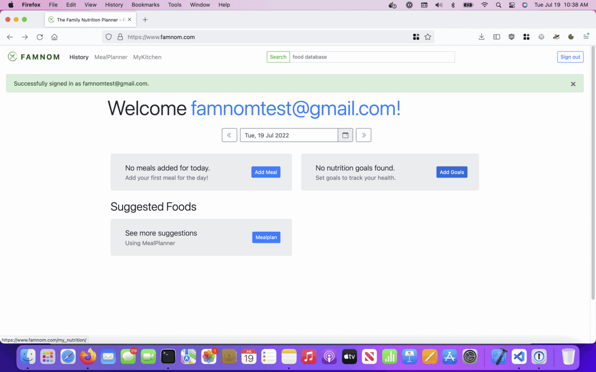
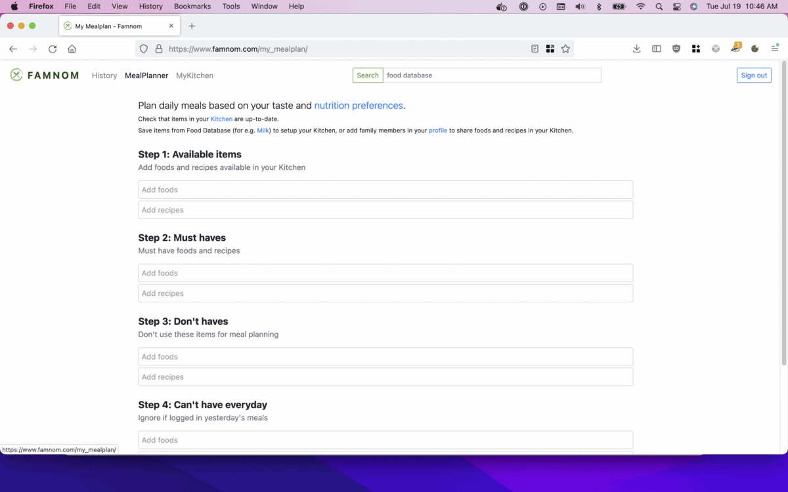

# Famnom
 

Famnom is an easy-to-use macro and micro-nutrient tracker, and meal planner. Choose from a database of foods or add your own, create recipes and log meals. Set custom nutrition goals or use FDA RDIs for macros - calories, fats, proteins, carbs and micro-nutrients - Magnesium, Calcium, Zinc, Iron, etc. Use MealPlanner to generate daily meal plans based on nutrition goals, available foods and recipes in the kitchen and taste preferences.

## Signup / Login:

## Search / Kitchen:

## Nutrition Goals:

## Mealplanner:

